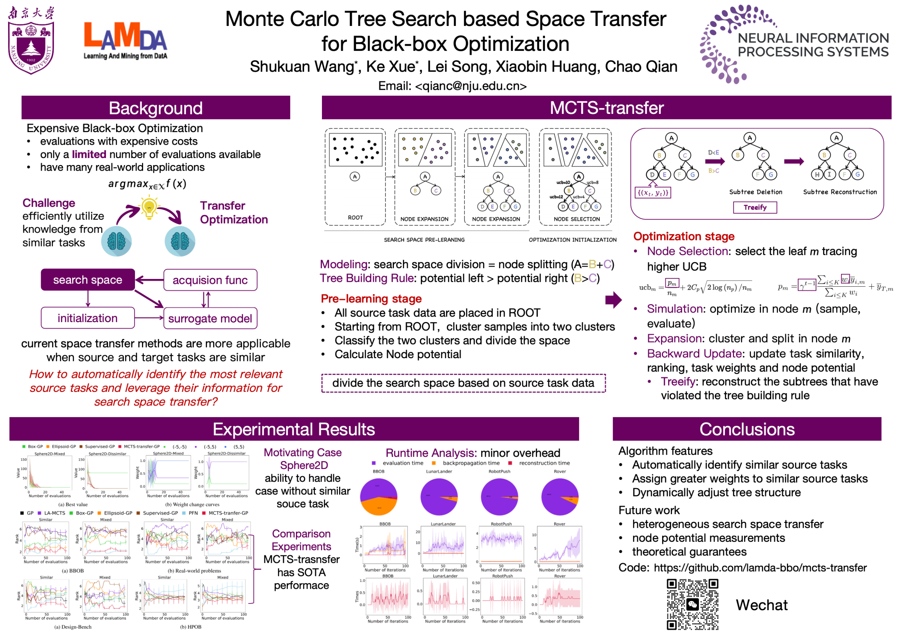

# Monte Carlo Tree Search based Space Transfer for Black Box Optimization
Official implementation of NeurIPS'24 paper ["Monte Carlo Tree Search based Space Transfer for Black Box Optimization"](https://openreview.net/pdf?id=T5UfIfmDbq).

This repository contains the Python code for MCTS-Transfer , an search space transfer algorithm for  expensive Black-Box Optimization. The code is implemented based on [LA-MCTS](https://github.com/facebookresearch/LaMCTS/tree/main). Data generation code is based on [RIBBO](https://github.com/songlei00/RIBBO).


## Requirements

Ubuntu == 20.04

Python == 3.8.0

```
pip install -r requirements.txt
```

Download data from the [link](https://drive.google.com/drive/folders/1hbxXdNM_CoON3EcfjcBGfUL21eKQdkiD?usp=sharing) to the directory /data.

Pretrained MCTS models can be downloaded from [link](https://drive.google.com/drive/folders/1EXUfrvv_v07o6_okst7gPaNT8yx5CFM3?usp=sharing) or generated automatically.

Download HPO-B surrogates from the [link](https://rewind.tf.uni-freiburg.de/index.php/s/rTwPgaxS2Z7NH39/download/saved-surrogates.zip) to directory /functions/hpob/saved-surrogates.

## Usage

```
# test on Sphere2D
bash experiments/run_sphere.sh

# test on BBOB
bash experiments/run_bbob.sh

# test on real-world problem
bash experiments/run_real.sh

# test on design-bench
bash experiments/run_design_bench.sh

# test on hpob
bash experiments/run_hpob.sh
```

## Citation
```
@inproceedings{mcts-transfer,
    author = {Shu-kuan Wang , Ke Xue, Song Lei, Xiao-bin Huang, Chao Qian},
    title = {Monte Carlo Tree Search based Space Transfer for Black Box Optimization},
    booktitle = {Advances in Neural Information Processing Systems 38 (NeurIPS’24)},
    year = {2024},
    address={Vancouver, Canada}
}
```